# Manual de Usuario

Este manual está diseñado para guiar tanto al usuario final como al administrador en el uso de la plataforma de gestión de suscripciones.

---

## Índice

1. [Introducción](#introducción)
2. [Manual para Usuario Final](#manual-para-usuario-final)
   - [Acceso e Inicio de Sesión](#acceso-e-inicio-de-sesión)
   - [Exploración y Suscripción a Servicios](#exploración-y-suscripción-a-servicios)
   - [Gestión de Perfil](#gestión-de-perfil)
   - [Métodos de Pago](#métodos-de-pago)
   - [Seguimiento de Gastos](#seguimiento-de-gastos)
   - [Soporte y Ayuda](#soporte-y-ayuda)
3. [Manual para Administrador](#manual-para-administrador)
   - [Acceso al Panel Administrativo](#acceso-al-panel-administrativo)
   - [Gestión de Usuarios](#gestión-de-usuarios)
   - [Gestión de Servicios y Planes](#gestión-de-servicios-y-planes)
   - [Reportes y Métricas](#reportes-y-métricas)
   - [Panel de Control](#panel-de-control)
   - [Soporte y Procedimientos de Mantenimiento](#soporte-y-procedimientos-de-mantenimiento)

---

## Introducción

La plataforma permite gestionar suscripciones, rastrear gastos, administrar servicios y generar reportes detallados. Este manual proporciona instrucciones paso a paso para realizar las acciones más comunes de acuerdo a tu rol.

---

## Manual para Usuario Final

### Acceso e Inicio de Sesión

1. **Pantalla de Inicio de Sesión:**  
   Ingresa tu correo electrónico y contraseña.  
   

2. **Registrar Cuenta:**  
   Si no cuentas con una cuenta, puedes registrarla, al hacerlo recibirás un código de verificación a tu correo proporcionado, debes ingresarlo para realizar la verificación.
   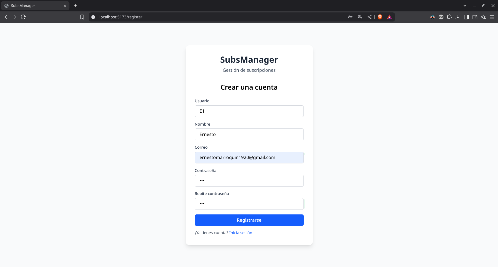
   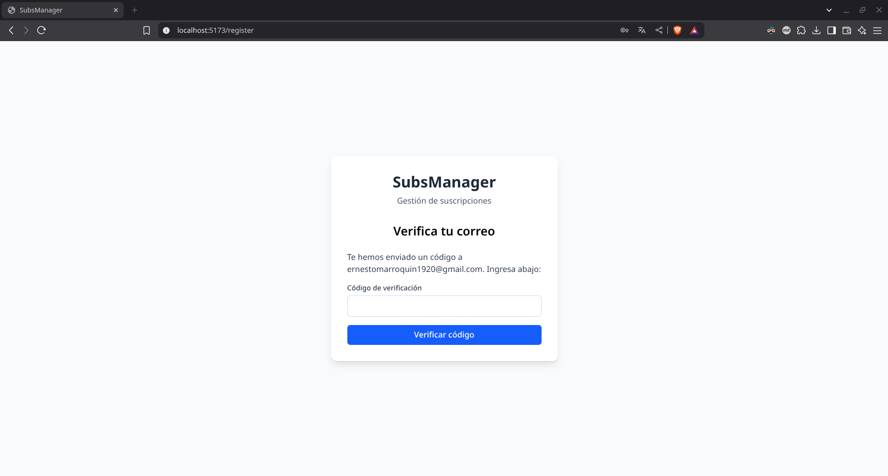
    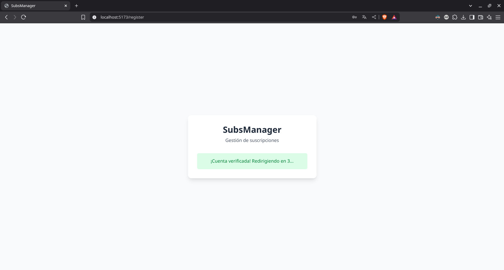

### Exploración y Suscripción a Servicios

1. **Explorar Servicios:**  
   Navega por la sección "Explorador de Servicios". Utiliza el buscador y los filtros de categoría para encontrar el servicio deseado.  
   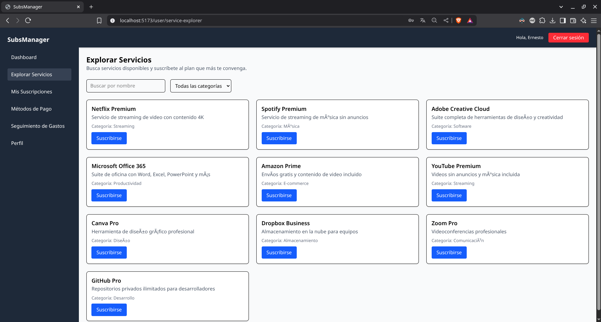

2. **Suscribirse a un Servicio:**  
   - Selecciona el servicio.
   - Elige el plan (mensual o anual).
   - Confirma la suscripción y se mostrará el precio correspondiente.  
   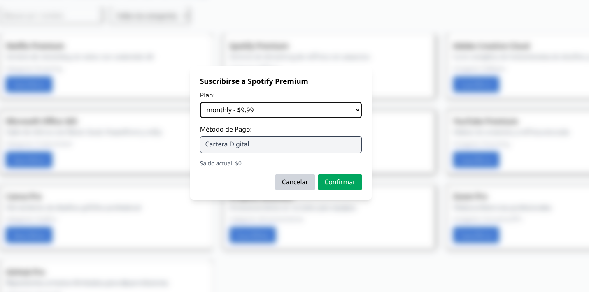

3. **Cancelar Suscripción:**  
   En la sección "Mis Suscripciones", podrás ver todas las suscripciones activas. Haz clic en "Cancelar" para finalizar una suscripción.
    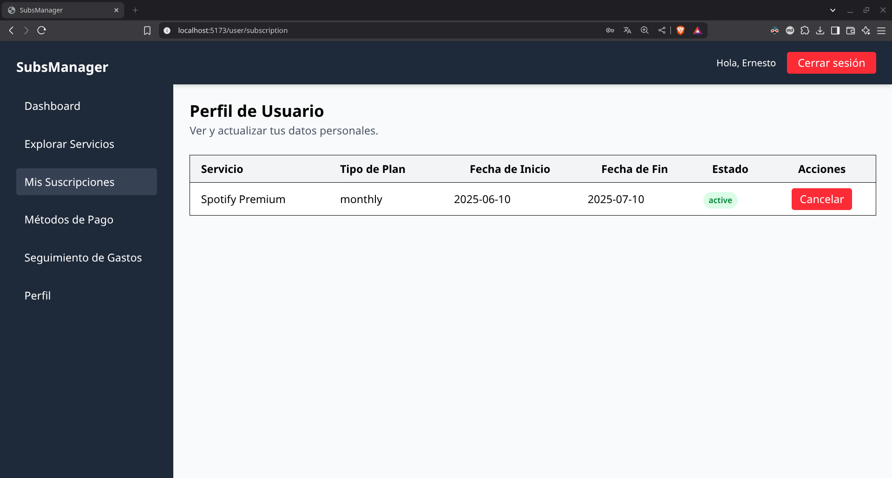
### Gestión de Perfil

1. **Visualización y Actualización de Datos:**  
   Accede a "Mi Perfil" para ver tus datos personales y modificar información como nombre, correo o usuario.  
   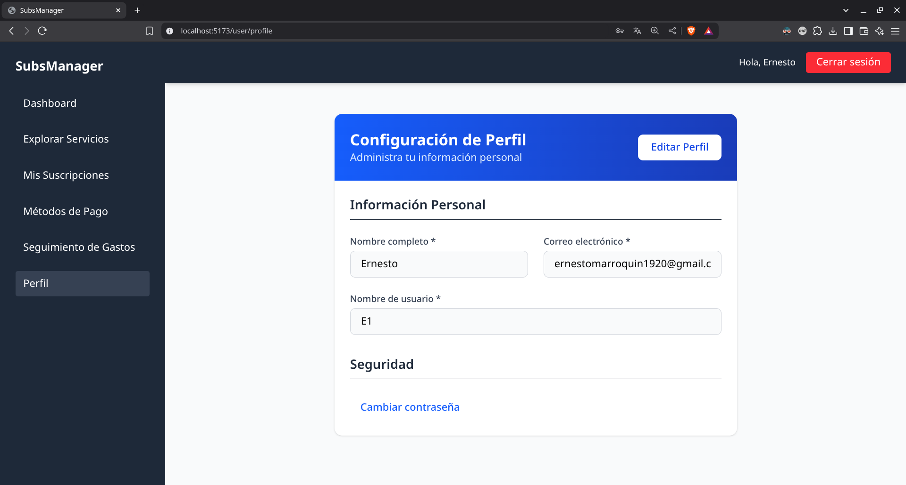

2. **Cambio de Contraseña:**  
   Selecciona la opción "Cambiar Contraseña" y sigue el proceso para actualizarla de forma segura.

### Métodos de Pago

1. **Consultar Métodos de Pago:**  
   Visualiza la lista de métodos de pago asociados y su información (tarjeta, efectivo, wallet).  
   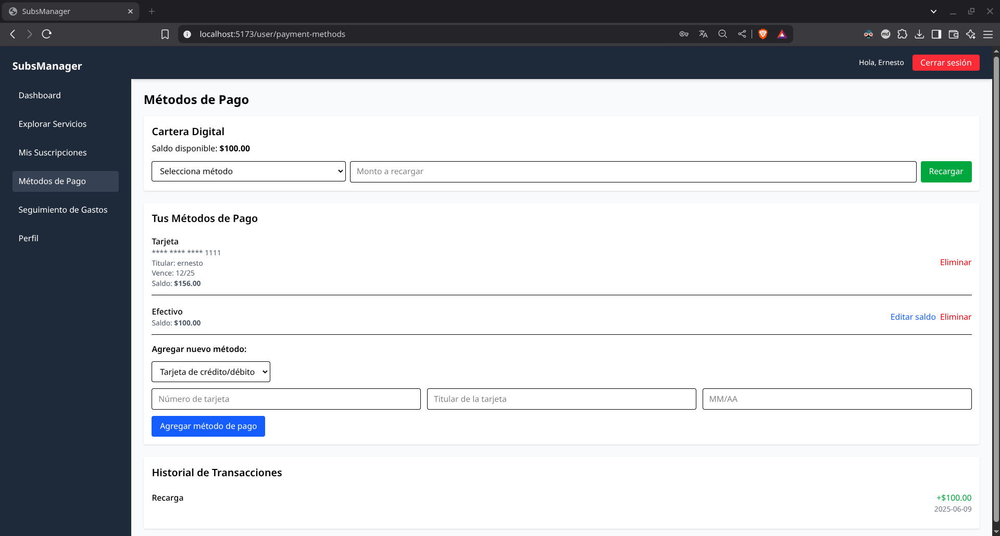

2. **Agregar o Eliminar un Método de Pago:**  
   Utiliza el formulario para añadir un nuevo método o selecciona la opción de eliminación para quitar uno ya registrado.

### Seguimiento de Gastos

1. **Seguimiento de Gastos:**  
   En la sección "Seguimiento de Gastos" podrás ver gráficos interactivos que muestran tus gastos mensuales.  
   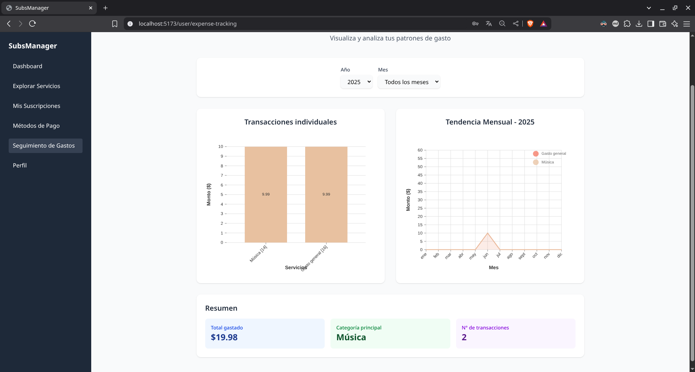

2. **Filtrado por Fecha y Categoría:**  
   Utiliza los filtros para seleccionar un periodo específico.

### Soporte y Ayuda

1. **Contacto:**  
   Si necesitas asistencia, utiliza el formulario de contacto o revisa la sección de ayuda en el sitio.

---

## Manual para Administrador

### Acceso al Panel Administrativo

1. **Inicio de Sesión como Administrador:**  
   Ingresa con tus credenciales de administrador.  
   

2. **Dashboard Administrativo:**  
   Una vez autenticado, serás redirigido al panel de control, donde se muestran estadísticas generales y accesos a diversas funcionalidades.

### Gestión de Usuarios

1. **Gestion de Usuarios:**  
   Revisa el listado de usuarios registrados, con detalles como nombre, correo y estado de la cuenta.
2. **Editar y Eliminar Usuarios:**  
   - Haz clic en "Editar" para modificar la información del usuario.
   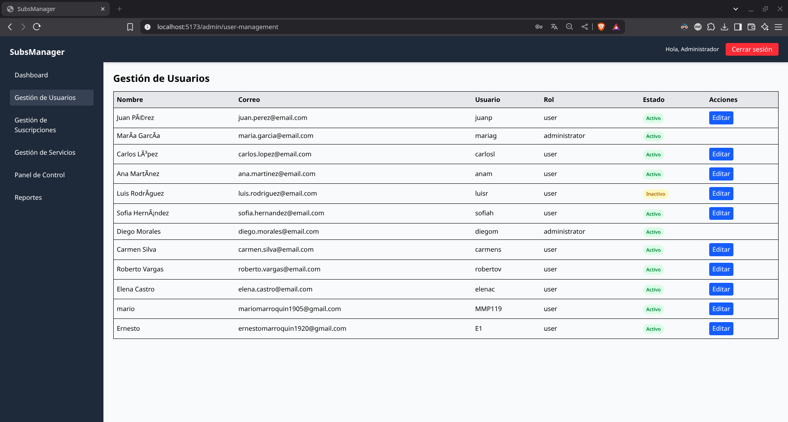

### Gestión de Servicios y Planes

1. **Listado y Administración de Servicios:**  
   Visualiza todos los servicios registrados y sus respectivos planes.
2. **Crear, Actualizar y Eliminar Servicios:**  
   Utiliza el formulario para agregar un nuevo servicio o editar uno existente.  
   

### Reportes y Métricas

1. **Generación de Reportes:**  
   Descarga reportes en formato HTML que agrupan datos por usuario, categoría, ingresos, etc.  
   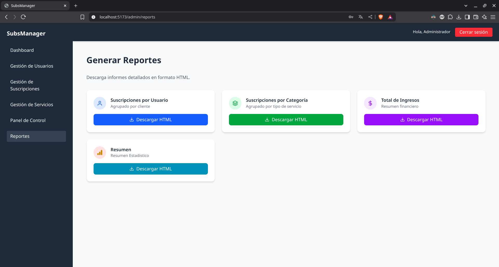

2. **Interpretación de Datos:**  
   Aprende a interpretar cada reporte mediante una breve descripción y ejemplos incluidos en el manual.

### Panel de Control

1. **Visualización de Métricas:**  
   El panel de control muestra gráficos interactivos de usuarios, suscripciones, ingresos y estados.  
   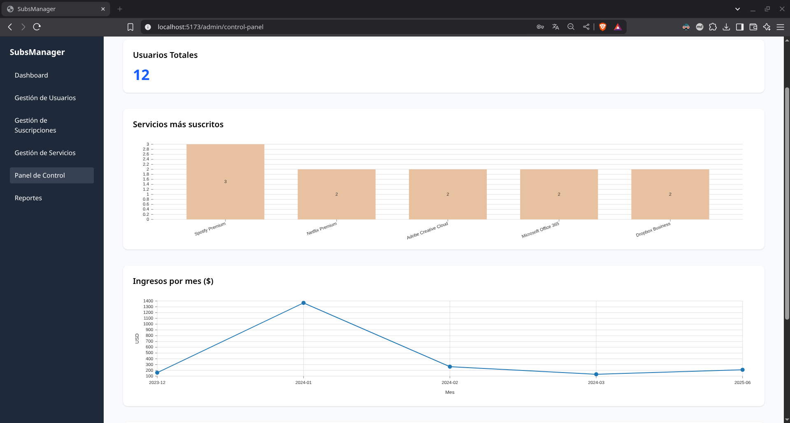

---

## Nota:

Este manual de usuario ha sido creado para facilitar la navegación y el uso de la plataforma, tanto para usuarios finales como para administradores. Se recomienda revisar periódicamente el manual para estar al tanto de las nuevas funciones y mejoras.

Para cualquier duda o consulta adicional, por favor contacta al equipo de soporte técnico.